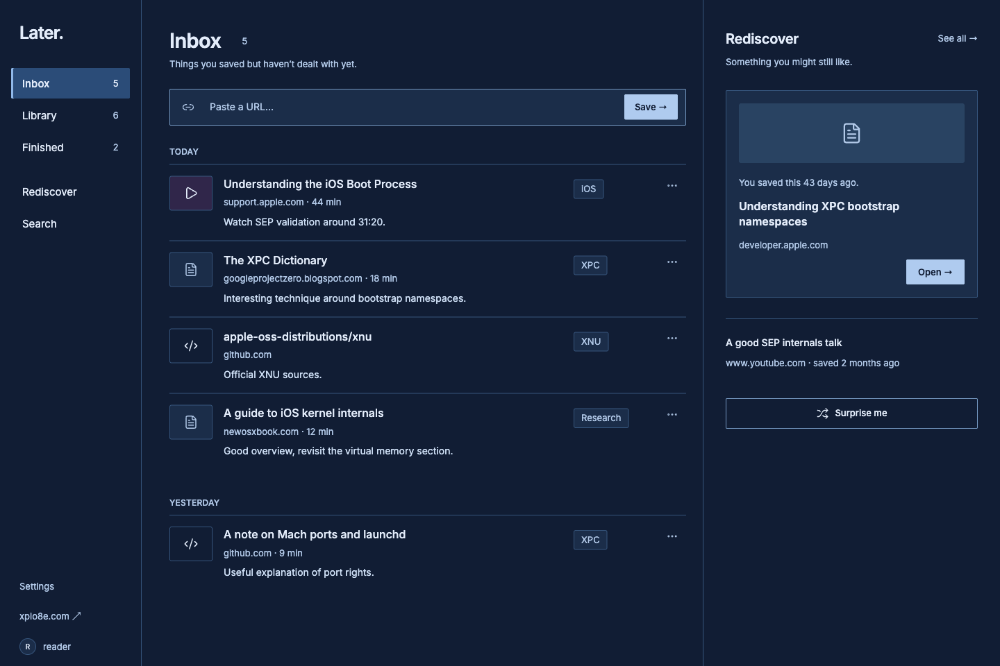
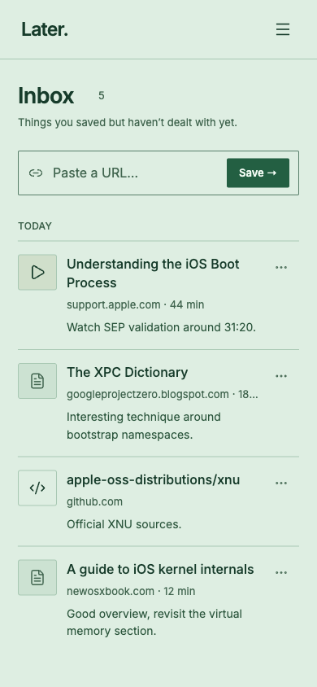
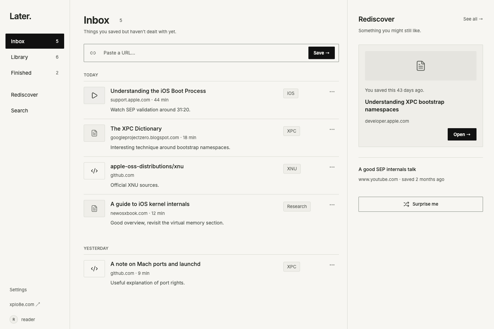
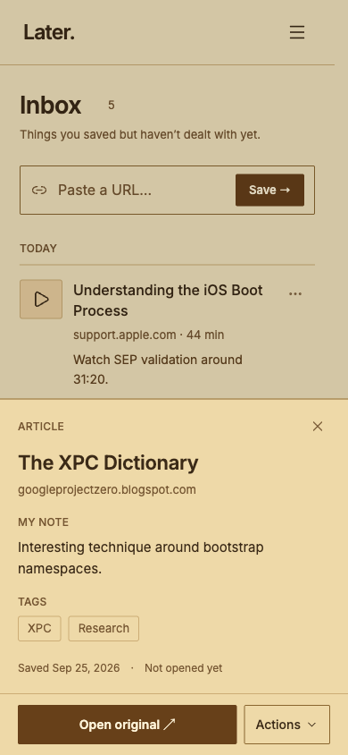

<h1 align="center">Later</h1>

<p align="center">
  <a href="https://github.com/Xplo8E/later/releases/latest"></a>
  <a href="LICENSE"></a>
</p>

<p align="center">A private, single-owner internet library.</p>

Save a URL with a note, organize it when convenient, and rediscover older unfinished links.

## Screenshots

<table>
  <thead>
    <tr>
      <th align="center" width="70%">Desktop</th>
      <th align="center" width="30%">Mobile</th>
    </tr>
  </thead>
  <tbody>
    <tr>
      <td align="center" valign="top" width="70%">
        <a href="docs/assets/screenshots/desktop-inbox-midnight.png"></a>
      </td>
      <td align="center" valign="top" width="30%">
        <a href="docs/assets/screenshots/mobile-inbox-mint.png"></a>
      </td>
    </tr>
    <tr>
      <td align="center" valign="top" width="70%">
        <a href="docs/assets/screenshots/desktop-inbox-light.png"></a>
      </td>
      <td align="center" valign="top" width="30%">
        <a href="docs/assets/screenshots/mobile-note-sepia.png"></a>
      </td>
    </tr>
  </tbody>
</table>

## Run locally

Use Node 22.13 or newer.

```bash
npm ci
cp .dev.vars.example .dev.vars
npm run db:migrate
npm run dev
```

Open the development server at port 4173 on localhost. The explicit `LOCAL_DEV=true` flag is accepted only by a development build on loopback. The production build removes that authorization path.

To add the optional design examples to the local database:

```bash
npm run db:seed
```

The seed command always uses local D1. The examples are review fixtures with real public URLs, not an imported personal library.

## Features

- Save URLs with notes, duplicate detection, and automatic metadata fetching with retry.
- Edit titles and tags, move links through Inbox, Library and Finished, and rediscover unread items.
- Search titles, sources, notes and tags; filter by tag; export your library as JSON.
- Six palettes: Light, Sepia, Mint, Dark, Midnight and Cocoa, plus device appearance. Inter typography, thin rules, and compact mobile navigation.
- Install on Android for standalone launch and share-menu capture. Review shared links before saving; owner sign-in is required.

Saving does not wait for metadata. A blocked or unavailable external website leaves the saved URL and note intact. Suggested tags use a small deterministic keyword list; there is no AI service.

## Share to Later on Android

Install Later through Chrome, then share a link from another app and choose Later. Sign in as the owner, review the URL and note, and save. Nothing saves automatically, and duplicates leave existing notes intact.

If Later is missing from the share menu, see the [Android setup and verification guide](docs/SHARING.md). A bookmark-only shortcut does not register a share target.

## Verify

```bash
npm run build
npm test
```

The tests use actual local D1 and the compiled Worker, plus isolated service-worker checks. They cover authentication, owner restrictions, origin validation, duplicate races, lifecycle actions, literal search, pagination, metadata parsing and preservation of manual edits, data export/deletion, and PWA cache privacy.

For local responsive review, open `/__review` while the development server is running. Its iframe uses real CSS viewport widths. This review interface is excluded from the production bundle. It is a Chromium layout check, not a replacement for testing an installed app on a physical phone.

## Deploy

Follow the [deployment guide](docs/DEPLOYMENT.md) to configure Cloudflare, D1, and owner-only Access with GitHub sign-in. Set your HTTPS `appOrigin` and replace the template's reference values and placeholders in `deployment.config.json`; no source edits are required.

```bash
cp deployment.config.json.example deployment.config.json
# Fill in your origin, account, database and Access application values.
npm run deploy -- --prepare-only
npm run deploy -- --validate-only
```

These commands prepare, build, and test without remote changes. Once authentication and Access are configured, `npm run deploy` applies D1 migrations and publishes the Worker and assets. It does not seed production.

For the optional ChatGPT connector, follow the [connector setup guide](docs/CONNECTOR.md#setup).

## Project map

| Location | Purpose |
| --- | --- |
| `src/` | React interface and browser API adapter |
| `shared/` | API types, settings and theme definitions |
| `worker/` | Authentication, validation, metadata and D1 APIs |
| `migrations/` | D1 schema |
| `public/` | Public login assets, manifest, icons and offline fallback |
| `tests/` | D1, Worker, security and PWA checks |
| `scripts/` | Local seed, icon rendering and deployment |
| `docs/` | Deployment instructions and verification limits |

The favicon uses an outlined Inter “L” so its appearance does not depend on an operating-system font. `node scripts/generate-icons.mjs` renders the committed vector to the required PNG sizes.

## Privacy boundaries

Cloudflare Access and the Worker both protect the private application. Private API responses and application documents are not stored in the service-worker cache. Only the generic offline page is cached. Opening and editing the library requires a connection and a valid session.

External metadata requests are bounded, redirects and DNS answers are checked, and non-public addresses are rejected. DNS checking and fetching are separate operations; the code does not guarantee DNS pinning. Optional remote thumbnails are loaded with no referrer. Turning off automatic metadata avoids new metadata fetches.

See [docs/VERIFICATION.md](docs/VERIFICATION.md) for the current evidence and the checks still needed after deployment.

The private ChatGPT MCP connector provides search, read, save, edit and reversible lifecycle tools, plus one-call capture with tags/status, atomic note appending and additive tags. It uses separate owner-only authentication and exposes no permanent deletion. See [docs/CONNECTOR.md](docs/CONNECTOR.md) for request-ID retry semantics, configuration and verification status. It stays disabled until a separate MCP Access audience is configured.

## License

Copyright (C) 2026 Vinay Kumar Rasala (Xplo8E).

Licensed under the GNU Affero General Public License v3.0 or later.
See [LICENSE](LICENSE).
